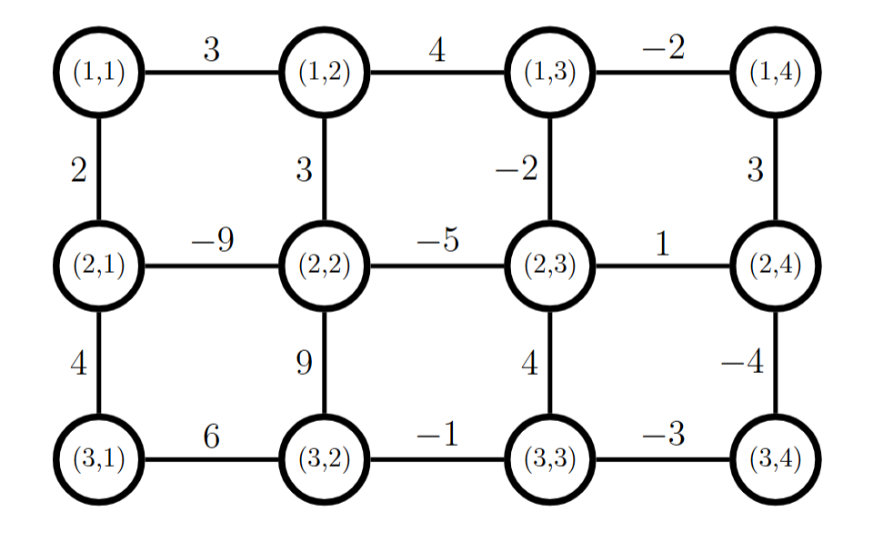
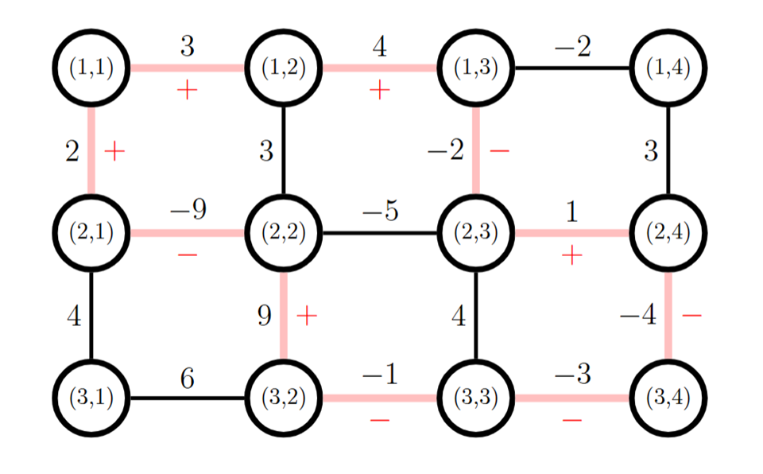

# Description

There are n×m crossroads in the city, named crossroad (1,1),(1,2),…,(n,m). The first number represents the row, and the second represents the column.

There exists and only exists streets between (i,j) and (i+1,j) or between (i,j) and (i,j+1). The street between (i,j) and (i+1,j) has a weight of wi,j, and the street between (i,j) and (i,j+1) has a weight of i,j.

Simons wants some streets reconstructed. Due to some accidents, some of the streets cannot be reconstructed, while others are optional to be reconstructed.

For each crossroad, if the number of reconstructed streets adjacent to it is even, Simons calls the crossroad elegant. If all the crossroads are elegant, Simons calls the reconstruction nice.

The beauty of a reconstruction is calculated as follows:

At first, the beauty is 0.For each row i from 1 to n−1, let the columns of the streets reconstructed be c1<c2<c3<⋯, add wi,c1−wi,c2+wi,c3−wi,c4+⋯ to the beauty.

Similarly, for each column j from 1 to m−1
, let the rows of the streets reconstructed be r1<r2<r3<⋯, add vr1,j−vr2,j+vr3,j−vr4,j+⋯ to the beauty.
In other words, if a street is an odd-indexed one reconstructed in its row or column, add its weight to the beauty; else subtract it from the beauty.

For example, consider the streets and crossroads below without any streets that cannot be reconstructed:



We can have a nice reconstruction as follows:



The beauty of the reconstruction is 3+4+2−(−9)−(−2)+9+1−(−1)−(−3)−(−4)=38.

Help Simons find the maximum beauty among all the nice reconstructions.

Input :-

Each test contains multiple test cases. The first line contains the number of test cases t (1≤t≤5⋅104). The description of the test cases follows.

The first line contains two integers n and m (2≤n,m≤2⋅105; n⋅m≤4⋅105) — the number of rows and columns.

In the next n−1 lines, each line contains m integers wi,j (−109≤wi,j≤109) — the weights of the street between (i,j) and (i+1,j).

In the next n lines, each line contains m−1 integers vi,j (−109≤vi,j≤109) — the weights of the street between (i,j) and (i,j+1).

In the next n−1 lines, each line contains m characters pi,j (pi,j∈{0,1}) — if pi,j=0, the street between (i,j) and (i+1,j) cannot be reconstructed, and vice versa.

In the next n lines, each line contains m−1 characters qi,j (qi,j∈{0,1}) — if qi,j=0, the street between (i,j) and (i,j+1) cannot be reconstructed, and vice versa.

It is guaranteed that the sum of n⋅m over all test cases does not exceed 4⋅105.

Output :-

For each test case, output a single integer — the maximum beauty among all the nice reconstructions.

## Example

**Input :-**
```
4
3 4
2 3 -2 3
4 9 4 -4
3 4 -2
-9 -5 1
6 -1 -3
1111
1111
111
111
111
2 4
4 23 1 35
6 12 -17
-14 1 -40
0100
000
101
3 3
1 0 1
0 1 0
1 0
0 1
0 0
110
111
10
11
11
3 4
13 7 6 -12
3 -5 12 -6
-3 10 -15
-5 8 -11
10 0 -5
1111
0110
110
101
010
```

**Output :-**
```
38
0
4
8
```

Note :-

The first test case is explained in the statement.

In the second test case, there is only one nice reconstruction: Simons reconstructs no street. So the maximum beauty is 0.